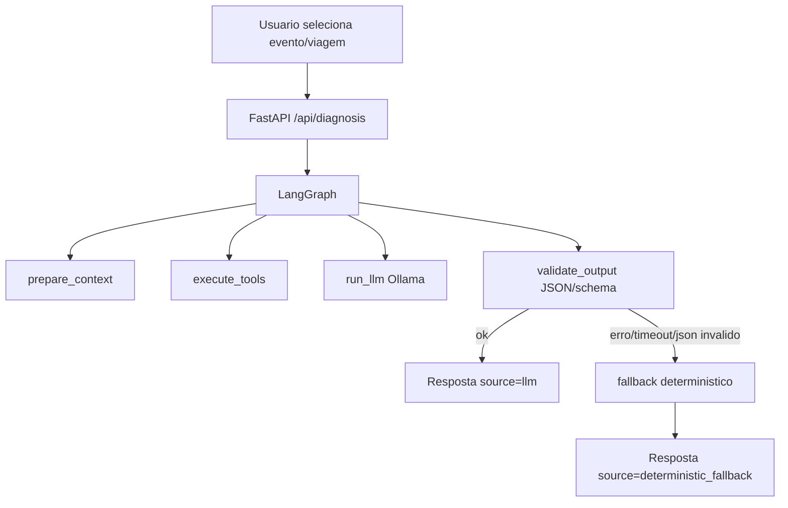

# FleetDoctor

Assistente de diagnostico operacional para frotas com **IA generativa local** integrada ao fluxo de triagem.

## 1) Problema e solucao

Em operacoes de frota, o gargalo nao e detectar evento, e sim transformar sinal em decisao acionavel.

Problemas comuns:
- alertas demais e pouca priorizacao
- investigacao lenta entre telas/sistemas
- diagnostico inconsistente entre analistas

Solucao no FleetDoctor:
- triagem operacional com filtros e drill-down
- diagnostico por evento/viagem usando **LLM local + fallback deterministico**
- geracao de relatorio executivo em HTML
- importacao de eventos por CSV

## 2) Arquitetura de LLM

Fluxo de diagnostico (`POST /api/diagnosis`):



Stack:
- Frontend: React + Vite + TypeScript + Tailwind + Recharts
- Backend: FastAPI + SQLAlchemy
- LLM orchestration: LangGraph
- Modelo local: Ollama
- Persistencia: SQLite local

## 3) Modelo local escolhido e trade-offs

Escolha: **Ollama** com modelo primario + fallback de modelo.

Motivos:
- custo zero por chamada
- privacidade local
- controle de latencia e disponibilidade

Trade-offs:
- qualidade textual pode variar mais que APIs pagas
- modelos menores tendem a ser mais genericos
- setup local exige ambiente preparado

Se trocar para API paga:
- ganho esperado: qualidade de raciocinio e tool calling mais robusto
- perda esperada: custo por uso e menor controle de dados locais

## 4) Framework escolhido

Escolha: **LangGraph simples** (single graph) em vez de multiagente.

Justificativa:
- controla explicitamente o fluxo de contexto -> tools -> modelo -> validacao -> fallback
- menor complexidade operacional para prazo curto
- suficiente para demonstrar decisao de engenharia de framework

Implementacao do grafo:
- [backend/app/agents/langgraph_diagnosis_graph.py](backend/app/agents/langgraph_diagnosis_graph.py)

## 5) Prompts e estrategia de prompting

Arquivos:
- [prompts/system_prompt.txt](prompts/system_prompt.txt)
- [prompts/diagnosis_event_template.txt](prompts/diagnosis_event_template.txt)
- [prompts/diagnosis_trip_template.txt](prompts/diagnosis_trip_template.txt)

Estrategia aplicada:
- system prompt com regras de comportamento e formato JSON estrito
- templates separados por modo (evento vs viagem)
- delimitacao clara entre instrucoes e dados operacionais
- mitigacao de prompt injection: campos textuais tratados como dados, nunca como instrucao

## 6) Tools disponibilizadas ao LLM

Especificacao completa:
- [tools/diagnosis_tools_spec.md](tools/diagnosis_tools_spec.md)

Tools:
- `get_event_context(event_id)`
- `get_trip_context(trip_id)`
- `get_similar_events(event_type, region, limit)`
- `get_vehicle_recent_history(vehicle_id, days)`

Implementacao backend:
- [backend/app/services/diagnosis_tools.py](backend/app/services/diagnosis_tools.py)

## 7) Parametros do modelo

Configuracoes por ambiente:
- `LLM_PROVIDER` (default `ollama`)
- `OLLAMA_BASE_URL` (default `http://localhost:11434`)
- `OLLAMA_MODEL_PRIMARY`
- `OLLAMA_MODEL_FALLBACK`
- `LLM_TEMPERATURE` (default `0.2`)
- `LLM_TOP_P` (default `0.9`)
- `LLM_MAX_TOKENS` (default `500`)
- `LLM_TIMEOUT_MS` (default `6000`)
- `LLM_FORCE_DETERMINISTIC` (forca fallback para testes/demo)

Racional:
- temperatura baixa para consistencia
- top-p moderado para manter variacao controlada
- timeout para nao degradar UX

## 8) Contrato de API de diagnostico

Endpoint: `POST /api/diagnosis`

Request:
```json
{
  "event_id": 12,
  "debug": false,
  "force_deterministic": false
}
```

Response (compativel + metadados opcionais):
```json
{
  "severity": "high",
  "summary": "...",
  "probable_causes": ["..."],
  "recommended_actions": ["..."],
  "evidence": ["..."],
  "source": "llm",
  "model": "qwen2.5:7b-instruct",
  "latency_ms": 842,
  "used_tools": ["get_event_context", "get_similar_events", "get_vehicle_recent_history"],
  "fallback_reason": null
}
```

Health da camada LLM:
- `GET /api/llm/health`

## 9) O que funcionou

- arquitetura hibrida evitou quebra funcional quando modelo local falha
- JSON schema + validacao reduziu respostas malformadas
- tools de contexto melhoraram utilidade das recomendacoes
- contrato da API foi mantido para o frontend existente

## 10) O que nao funcionou / limitacoes

- modelo local pequeno pode produzir recomendacoes genericas
- sem RAG nesta versao (usa somente contexto transacional atual)
- sem score probabilistico calibrado
- `upload/reset` continua destrutivo para contexto produtivo

## 11) Estrutura do repositorio

```text
fleetdoctor/
  prompts/
    system_prompt.txt
    diagnosis_event_template.txt
    diagnosis_trip_template.txt
  tools/
    diagnosis_tools_spec.md
  agents/
    README.md
  backend/
    app/
      agents/
        langgraph_diagnosis_graph.py
      routers/
        diagnosis.py
        llm.py
      services/
        diagnosis_engine.py
        diagnosis_tools.py
        llm_provider.py
        output_validation.py
        diagnostics.py
    tests/
      routers/
        test_health.py
        test_diagnosis.py
        test_reports.py
        test_upload.py
        test_llm.py
  frontend/
    src/pages/
      Triage.tsx
  docs/
    pitch_3min.md
```

## 12) Como executar

### Requisitos
- Python 3.11+
- Node.js 20+
- npm 10+
- Ollama instalado localmente

### Backend
```bash
cd backend
python -m venv .venv
.\.venv\Scripts\activate
pip install -r requirements.txt
python -m app.seed
uvicorn app.main:app --reload
```

### Frontend
```bash
cd frontend
copy .env.example .env
npm install
npm run dev
```

### Testes backend
```bash
cd backend
pip install -r requirements-dev.txt
pytest -q tests -p no:cacheprovider
```

## 13) CI

Workflow em:
- `.github/workflows/ci.yml`

Executa:
- `pytest` backend
- `npm run build` frontend

## 14) Roteiro de apresentacao

- [docs/pitch_3min.md](docs/pitch_3min.md)
