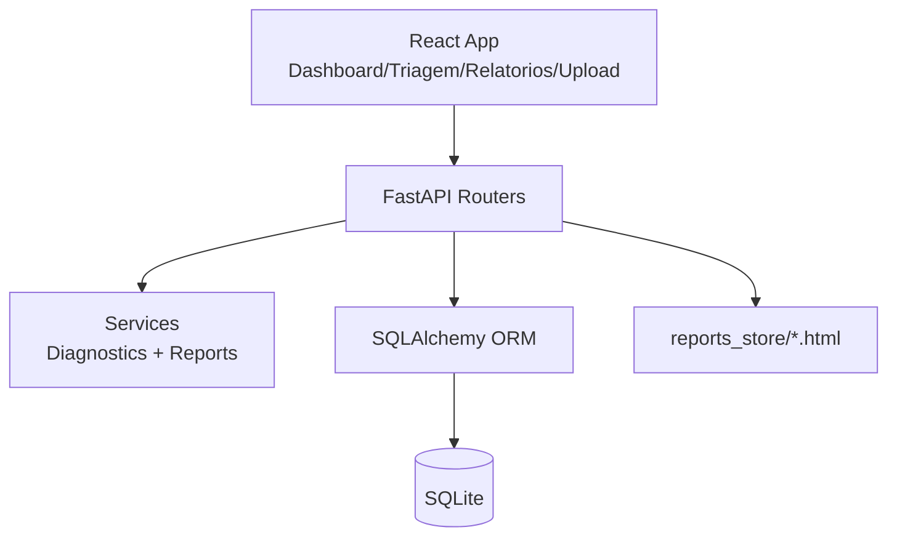

# FleetDoctor

Assistente de diagnostico operacional para frotas, com foco em triagem de eventos, investigacao rapida e geracao de relatorios executivos.

Stack atual:
- Frontend: React + Vite + TypeScript + Tailwind + Recharts
- Backend: FastAPI + SQLAlchemy
- Banco: SQLite local
- Diagnostico: motor deterministico (mock IA)

## Como baixar / requisitos
Requisitos:
- Python 3.11+ (testado com Python 3.13)
- Node.js 20+ (LTS recomendado)
- npm 10+
- ngrok (opcional, para expor a API local)

Como clonar:
```bash
git clone https://github.com/nathan-arrais/fleetdoctor
cd fleetdoctor
```

Execucao rapida:

Backend:
```bash
cd backend
python -m venv .venv
.\.venv\Scripts\activate
pip install -r requirements.txt
python -m app.seed
uvicorn app.main:app --reload
```

Frontend:
```bash
cd frontend
copy .env.example .env
npm install
npm run dev
```

## Links de entrega
- Frontend (Vercel): `https://fleetdoctor.vercel.app/`
- Backend (Render): `https://fleetdoctor.onrender.com/`
- Repositorio GitHub: `https://github.com/nathan-arrais/fleetdoctor`

Checklist rapido antes da aula:
- backend responde em `/api/health`
- frontend navega entre `Dashboard`, `Triagem`, `Veiculo`, `Viagem`, `Relatorios`, `Upload`
- upload CSV funciona com preview/import/reset
- README atualizado com evidencias de uso do agente e limitacoes reais

## 1) Problema e solucao proposta
Em operacoes de frota, o problema nao e apenas detectar eventos, mas transformar eventos em decisao.

Problemas tipicos:
- muitos alertas sem priorizacao clara
- dificuldade para correlacionar evento, veiculo e viagem
- investigacao lenta (dados espalhados em varias telas/sistemas)
- relatorios gerenciais dependentes de extracao manual

Solucao proposta pelo FleetDoctor:
- centralizar eventos operacionais em uma triagem unica
- aplicar filtros por periodo, tipo, severidade, regiao e status
- oferecer diagnostico instantaneo por evento/viagem via regras deterministicas
- permitir drill-down para paginas de veiculo e viagem
- gerar relatorio executivo HTML com resumo de KPIs e recomendacoes
- importar eventos via CSV para alimentar a base rapidamente em demos/pilotos

## 2) Escolhas de design (justificativa da stack)
- `FastAPI`: entrega API tipada rapidamente, com validacao por schema e baixo atrito para evolucao.
- `SQLAlchemy`: mapeamento ORM simples para dominio relacional (veiculos, viagens, eventos, relatorios).
- `SQLite`: escolha pragmatica para desenvolvimento local e demo sem dependencia externa.
- `React + Vite + TypeScript`: produtividade alta no frontend, build rapido e tipagem para reduzir regressao.
- `Tailwind`: aceleracao de UI sem overhead de design system complexo no primeiro ciclo.
- `Recharts`: graficos de tendencia com pouca configuracao, suficiente para dashboard operacional.

Trade-off assumido:
- arquitetura otimizada para velocidade de entrega e validacao funcional, nao para escala multi-tenant.

## 3) Arquitetura (diagrama + explicacao textual)


Explicacao:
- O frontend consome a API via `fetch`, usando `VITE_API_BASE_URL`.
- A camada `routers` recebe requests, valida parametros e orquestra consultas.
- A logica de negocio esta em `services`:
  - `diagnostics.py`: regras deterministicas de diagnostico.
  - `reports.py`: agregacoes e montagem de HTML executivo.
- Persistencia em SQLite via modelos ORM (`Vehicle`, `Trip`, `Event`, `Report`).
- Relatorios gerados sao persistidos no banco e tambem escritos em disco (`backend/app/reports_store`).

## 4) Fluxo da aplicacao (passo a passo do usuario)
1. Usuario abre `Dashboard` e ajusta filtros de periodo, regiao e status.
2. Usuario clica em um card de KPI (ex.: atrasos), indo para `Triagem` com query params pre-preenchidos.
3. Em `Triagem`, aplica filtros finos e busca textual (placa, motorista, origem/destino, descricao).
4. Usuario seleciona um evento na tabela.
5. A UI abre drawer lateral e chama `POST /api/diagnosis` com `event_id`.
6. Drawer exibe resumo, causas provaveis, acoes recomendadas e evidencias.
7. Usuario pode abrir detalhe do `Veiculo` ou da `Viagem` para contexto historico.
8. Em `Relatorios`, usuario define filtros e gera relatorio executivo.
9. Relatorio fica listado com `Preview` e `Download`.
10. Em `Upload`, usuario envia CSV, valida colunas, importa e opcionalmente executa reset para voltar ao dataset demo.

## 5) Upload de dados (CSV)
Endpoints:
- `POST /api/upload/preview`
- `POST /api/upload/import`
- `POST /api/upload/reset`

Colunas obrigatorias do CSV:
- `vehicle_id`
- `plate`
- `trip_id`
- `event_type`
- `severity`
- `timestamp`
- `description`

Coluna opcional usada no import:
- `value_num` (convertida para `float` quando possivel)

Comportamento do import:
- valida colunas obrigatorias
- aceita CSV UTF-8 com ou sem BOM (`utf-8-sig`)
- normaliza `event_type` e `severity` para lowercase antes da validacao
- normaliza `event_type` invalido para `route_deviation`
- normaliza `severity` invalida para `low`
- tenta localizar veiculo por `code`, depois por `id` (se numerico), depois por `plate`
- se nao encontrar veiculo, cria novo registro "importado" com `code` e `plate` unicos
- `trip_id` vazio: nao cria trip; evento fica com `trip_id = null`
- `trip_id` numerico:
  - tenta `Trip.id`
  - se nao existir (ou pertencer a outro veiculo), reaproveita/cria trip sintetica por chave `origin=IMPORT-{trip_id}` + `vehicle_id`
- `trip_id` textual (nao vazio):
  - reaproveita/cria trip sintetica por chave `origin=IMPORT-{trip_id}` + `vehicle_id`
- parse de timestamp usa ISO; se falhar, usa `datetime.utcnow()`
- resposta retorna total importado: `{"imported": N}`
- endpoint `upload/reset` retorna erro 500 se nao conseguir remover o banco

Arquivo de exemplo:
- `frontend/public/sample_upload.csv`

## 6) Mock IA (como funciona o diagnostico deterministico)
O diagnostico atual nao usa LLM. Ele aplica regras fixas com base no `event.type`.

Fluxo:
- `POST /api/diagnosis` recebe `event_id` ou `trip_id`
- se `event_id`: executa `diagnose_event(event)`
- se `trip_id`: executa `diagnose_trip(session, trip)`

Regras por tipo de evento:
- `delay`: causas de rota/paradas, recomendacoes de ajuste operacional
- `temp_out_of_range`: foco em refrigeracao, vedacao e calibracao
- `excessive_stops`: foco em planejamento e disciplina operacional
- `excessive_idle`: foco em docas e alertas de tempo parado
- outros tipos: fallback generico

Determinismo:
- mesmo input gera mesmo output estrutural
- severidade final no diagnostico de viagem usa ranking fixo (`low < medium < high < critical`)

## 7) Como a IA seria integrada no futuro
Evolucao recomendada em camadas:
1. `AI Adapter` dedicado (`services/ai_provider.py`) para desacoplar provedor/modelo da regra de negocio.
2. `Hybrid mode`: diagnostico deterministico como fallback + LLM para enriquecimento textual/contextual.
3. `RAG`: recuperar historico de falhas, manutencoes e incidentes similares antes da geracao de resposta.
4. `Observabilidade`: logging de prompts/respostas, versao de modelo, latencia, custo e taxa de fallback.
5. `Safety`: mascaramento de dados sensiveis, guardrails e validacao semantica de resposta.
6. `Aprendizado`: loop de feedback humano (aceitou/rejeitou recomendacao) para calibracao continua.

## 8) Uso do agente de codificacao (o que funcionou e estrategia incremental)
Estrategia incremental que funcionou melhor:
1. modelar dominio minimo (`Vehicle`, `Trip`, `Event`, `Report`) e seed deterministico
2. fechar contratos de API essenciais (`dashboard`, `triage`, `diagnosis`)
3. construir frontend por fluxo de usuario (Dashboard -> Triagem -> Drill-down)
4. adicionar capacidades secundarias (`reports`, `upload`) sem quebrar fluxo principal
5. refinar UX com query params persistidos, filtros e navegacao entre telas

Padrao de colaboracao com agente que trouxe resultado:
- tarefas pequenas e verificaveis por endpoint/tela
- validacao continua com chamadas reais de API
- foco em primeiro entregar comportamento, depois ajustar forma

Prompts/solicitacoes que funcionaram melhor (exemplos reais de iteracao):
- "Crie endpoint de triagem com filtros de periodo, severidade, tipo e paginacao."
- "Implemente pagina de Triagem com query params persistidos e drawer de diagnostico."
- "Adicione upload CSV com preview de colunas obrigatorias e import."
- "Gerar relatorio executivo HTML com KPIs, top listas e download."
- "Corrija integridade do import sem mudar contratos da API (trip por veiculo, fallback estavel, etc.)."

Pontos em que foi necessario ajuste manual apos geracao:
- hardening de import (unicidade de code/plate, caso BOM, enums case-insensitive, consistencia trip-veiculo)
- correcoes de seguranca no HTML de relatorios (escape de campos interpolados)
- alinhamento de filtros no relatorio para evitar KPI inconsistente sob busca textual

## 9) O que nao funcionou / limitacoes (analise critica real)
Limitacoes tecnicas observadas no estado atual:
- upload aceita apenas CSV (nao ha suporte nativo a XLSX nesta versao).
- upload nao e idempotente: reimportar o mesmo CSV duplica eventos.
- timestamp invalido no upload cai para `utcnow()` com warning, mas ainda sem rejeicao por linha.
- `upload/reset` e destrutivo e sem transacao (remove DB e recria seed), adequado para demo, inadequado para producao.
- mock de diagnostico nao possui score de confianca, explicabilidade probabilistica ou calibracao por historico.
- ausencia de autenticacao/autorizacao e trilha de auditoria.
- ausencia de testes automatizados no repositorio.
- SQLite local limita concorrencia e estrategia de deploy para ambiente multiusuario.

## 10) Endpoints principais com exemplos
Base local: `http://localhost:8000`

Saude:
```bash
curl "http://localhost:8000/api/health"
```

Dashboard:
```bash
curl "http://localhost:8000/api/dashboard/metrics?start=2026-02-01&end=2026-02-19&region=Sudeste&status=active"
```

Triagem paginada:
```bash
curl "http://localhost:8000/api/triage/events?start=2026-02-01&end=2026-02-19&type=delay&severity=high&page=1&page_size=10"
```

Diagnostico por evento:
```bash
curl -X POST "http://localhost:8000/api/diagnosis" \
  -H "Content-Type: application/json" \
  -d "{\"event_id\": 12}"
```

Diagnostico por viagem:
```bash
curl -X POST "http://localhost:8000/api/diagnosis" \
  -H "Content-Type: application/json" \
  -d "{\"trip_id\": 8}"
```

Detalhe de veiculo e eventos:
```bash
curl "http://localhost:8000/api/vehicles/1"
curl "http://localhost:8000/api/vehicles/1/events?start=2026-01-20&end=2026-02-19"
```

Detalhe de viagem e eventos:
```bash
curl "http://localhost:8000/api/trips/2"
curl "http://localhost:8000/api/trips/2/events"
```

Gerar relatorio:
```bash
curl -X POST "http://localhost:8000/api/reports/generate" \
  -H "Content-Type: application/json" \
  -d "{\"type\":\"executive\",\"start\":\"2026-02-01\",\"end\":\"2026-02-19\",\"region\":\"Sul\",\"status\":null,\"event_type\":\"delay\",\"severity\":\"high\",\"q\":null}"
```

Listar relatorios:
```bash
curl "http://localhost:8000/api/reports"
```

Preview/Download:
```bash
curl "http://localhost:8000/api/reports/1/preview"
curl "http://localhost:8000/api/reports/1/download"
```

Preview de upload CSV:
```bash
curl -X POST "http://localhost:8000/api/upload/preview" \
  -F "file=@frontend/public/sample_upload.csv"
```

Import de upload CSV:
```bash
curl -X POST "http://localhost:8000/api/upload/import" \
  -F "file=@frontend/public/sample_upload.csv"
```

Reset para dataset demo:
```bash
curl -X POST "http://localhost:8000/api/upload/reset"
```

## 11) Estrutura do repositorio
```text
fleetdoctor/
  backend/
    app/
      main.py
      db.py
      deps.py
      models.py
      schemas.py
      seed.py
      routers/
        health.py
        dashboard.py
        triage.py
        vehicles.py
        trips.py
        diagnosis.py
        reports.py
        upload.py
      services/
        diagnostics.py
        reports.py
      reports_store/
      fleetdoctor.db
    requirements.txt
  frontend/
    .env.example
    public/
      sample_upload.csv
    src/
      api/client.ts
      components/Layout.tsx
      pages/
        Dashboard.tsx
        Triage.tsx
        Vehicle.tsx
        Trip.tsx
        Reports.tsx
        Upload.tsx
      App.tsx
      main.tsx
    package.json
  README.md
```

## 12) Consideracoes finais
O FleetDoctor cumpre bem o objetivo de prototipo funcional: entrega fluxo fim-a-fim para monitorar eventos, priorizar ocorrencias, diagnosticar rapidamente e gerar relatorios.

Para avancar para um contexto produtivo, os proximos passos de maior impacto sao:
- adicionar testes automatizados e controle de qualidade de dado no upload
- evoluir o mock para arquitetura hibrida com IA real e fallback deterministico
- migrar persistencia para banco transacional gerenciado quando houver requisito de escala
